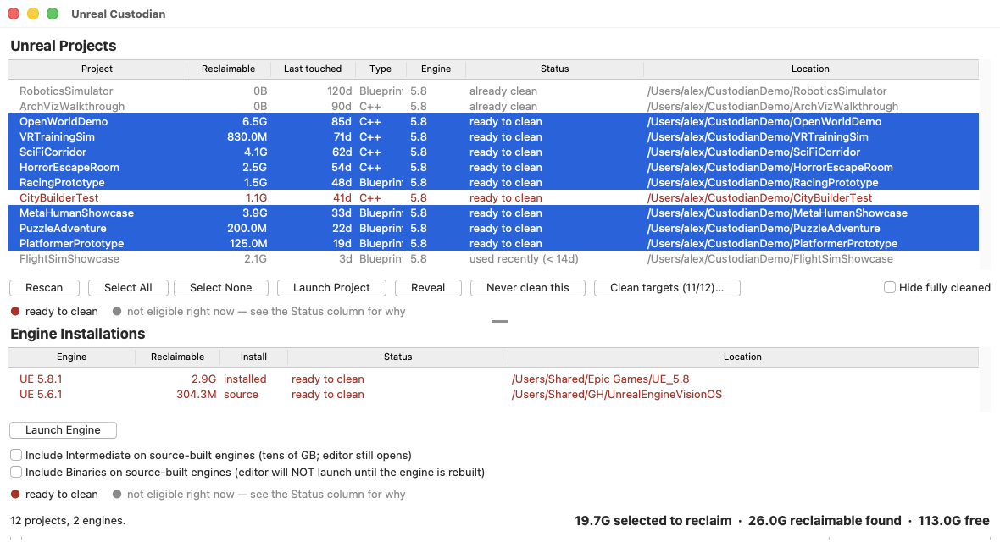
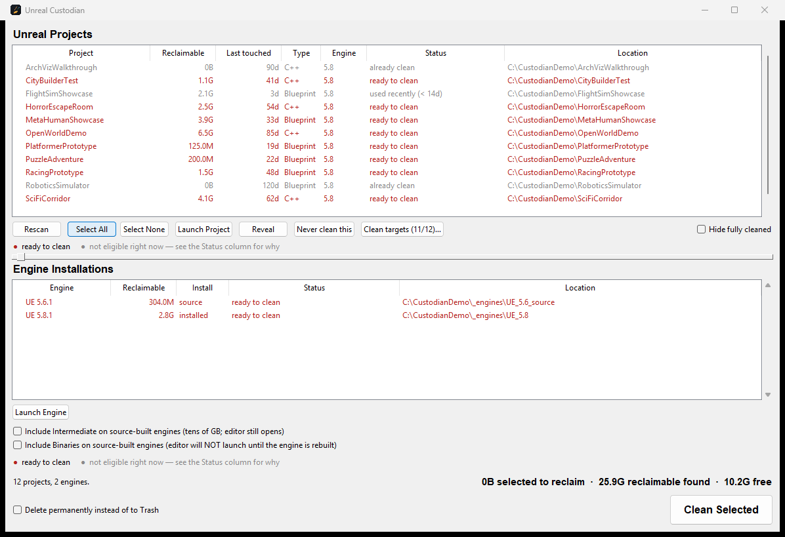

# Unreal Custodian

Find and reclaim the regeneratable build caches that Unreal Engine projects accumulate — `Intermediate`, `Binaries`, `DerivedDataCache`, cooked content and staged builds — across every project on your machine, without touching anything you authored.

A developer with a few years of Unreal projects on disk is typically sitting on tens or hundreds of gigabytes of pure rebuild artifacts. On the two machines this was tested against:

| | Projects | Engines | Reclaimable | Free space |
|---|---|---|---|---|
| macOS workstation | 96 | 2 | 224 GB | 60 GB |
| Windows workstation | 539 | 14 | **2.0 TB** | **17 GB** |

The Windows box had six source-built engines holding 60–75 GB each, and 17 GB of headroom.

Epic themselves agree these folders are junk: Fab's 15 GB submission limit is specified *excluding* `Saved` and `Intermediate`.




A real Finder/Explorer-style app — [standalone download](https://github.com/ibrews/unreal-custodian/releases/latest) for Mac and Windows, no Python required — or the same thing from the terminal:


## Before and after

Here is a real project in Finder, with the actual cleanup plan drawn on top — `custodian` tells you exactly which folders go, which shrink, and which it will not touch, before it touches anything. `GASP57`, 7.4 GB down to 5.1 GB:


Note what survives: `Content` (5.4 GB of authored assets), `Config`, the `.uproject`, and everything in `Plugins` and `Saved` except their build output. Everything removed regenerates on the next build.

A second project, `ThirdPersonClass`, where the caches dominated — 8.7 GB down to 359 MB:


## Install

**Just want the app? Grab a standalone build from the [latest release](https://github.com/ibrews/unreal-custodian/releases/latest)** — `Unreal.Custodian.macOS.zip` or `UnrealCustodian.exe`. No Python required either way.

- macOS: unzip and open — signed and notarized, no Gatekeeper warning
- Windows: unsigned — SmartScreen shows an "unknown publisher" click-through on first run

**Windows: install [Everything](https://www.voidtools.com/downloads/#cli) first, standalone app or not.** Discovery is index-first — on macOS that's Spotlight, already there, nothing to install. On Windows it's [Everything](https://www.voidtools.com/downloads/#cli)'s `es.exe`, and it is *not* installed by default. Without it on your `PATH`, Custodian silently falls back to a filesystem walk that can take minutes instead of well under a second — this is the single most common "why is this so slow" report. The GUI will now notice and tell you (once, dismissibly), but installing it up front skips that entirely.

Or run from source — no install needed for the CLI, and this is the only option if you want the latest unreleased fixes:

```bash
git clone https://github.com/ibrews/unreal-custodian.git
cd unreal-custodian
python3 -m custodian.cli report
```

Requires Python 3.9+. No dependencies for the CLI.

By default every drive gets searched. To restrict that — a slow or unreliable network/backup drive that happens to be mounted, or just wanting only the drive(s) Unreal projects actually live on considered — use **Search Settings…** in the GUI, or on the CLI:

```bash
python3 -m custodian.cli roots --set D:\ E:\Projects
python3 -m custodian.cli roots            # show the current setting
python3 -m custodian.cli roots --all      # back to searching everywhere
```

The setting is persisted (`~/.config/unreal-custodian/settings.json`, `%LOCALAPPDATA%\unreal-custodian\settings.json` on Windows) and shared by the CLI and GUI.

## Things to Try

1. **See what you're sitting on.** `python3 -m custodian.cli report` — inventories every Unreal project and engine install on the machine and prints total reclaimable bytes. Nothing is deleted; there is no flag that makes `report` destructive.
2. **Find out what it would cost you to reclaim it.** `python3 -m custodian.cli report --detail` — breaks each project down by directory and states what you pay to get each one back ("full rebuild", "re-cooked on next package", "UNRECOVERABLE if it held post-crash work").
3. **Preview a real cleanup.** `python3 -m custodian.cli clean --ignore-pressure` — prints the exact directories that would be removed. `clean` is a dry run unless you pass `--apply`.
4. **Protect a project you're about to return to.** Drop a `.ueclean.json` next to its `.uproject` containing `{"enabled": false}`, then re-run step 3 and watch it drop out of the plan with an "opted out" note.
5. **Actually reclaim it.** `python3 -m custodian.cli clean --apply` — everything goes to the Trash or Recycle Bin, not `rm -rf`, so a policy you disagree with costs you a drag-and-drop rather than a rebuild. Add `--permanent` once you trust it, which skips the bin and frees the space immediately.

## How it decides

**Disk pressure is the trigger; age is the ranking.** A plain "14 days untouched, delete it" rule will eventually eat the project you were about to reopen, and the cost of being wrong is asymmetric — a C++ project is a 10–20 minute rebuild plus a shader recompile, not a 10 second one. By default nothing happens until the volume drops below 100 GB free, and then the largest eligible projects are reclaimed until you are back above the line. Unreal cache sizes are strongly barbell-distributed — two projects were 26 % of the total on the development machine — so largest-first usually means touching very few projects.

Set `min_free_gb` to `0`, or pass `--ignore-pressure`, if you want age alone to trigger cleanup.

**Freshness is measured twice, because mtimes lie.** Copying a project, restoring it from backup, or syncing it through cloud storage rewrites every mtime and makes a long-dead project look like it was touched this morning. So alongside the filesystem mtime of `Content`/`Source`/`Config`, the tool reads Unreal's rotated editor logs, which encode their timestamp in the *filename* and therefore survive a copy intact. When the two disagree by more than a month, the report says so.

**Trash by default, permanent on request.** `--apply` moves reclaimed directories to the Trash or Recycle Bin so a mistake costs a drag-and-drop. The catch is that on the same volume this frees *no disk space at all* until the bin is emptied — so `--permanent` deletes outright for when you are actually out of room. The tool says which one it did, every time. Every project reuses the same generic folder names (`DerivedDataCache`, `Intermediate`, `Binaries`), so cleaning several projects in one run lands several items with the identical name in the Trash — they're disambiguated by project name (and a counter if even that collides), not by a timestamp that can't tell two things reclaimed in the same second apart.

**Refusals are reported, not fatal.** Directories owned by another user — extremely common in projects copied between machines — are reported up front with the owning uid, rather than failing one `move` at a time after the plan has already started running. If a `Plugins/Foo` directory is a symlink into a different checkout, reclaiming through it would delete build artifacts from a repository you never named — so it is skipped, with a note, and the rest of the project is still processed.

## Engine installs are usually the bigger prize

Projects get the attention, but a **source-built** engine holds far more reclaimable output than an entire project library. On the development machine:

| | UE 5.8 (launcher install) | UE 5.6 (source build) |
|---|---|---|
| `Engine/Intermediate` | 3.3 GB | **90.0 GB** |
| `Engine/Binaries` | 16 GB | **56.6 GB** |
| `Engine/DerivedDataCache` | 2.9 GB | 296 MB |
| Total install | 55 GB | 430 GB |

One source engine was holding **146.8 GB** of rebuildable output — nearly double all 96 projects combined.

**The distinction that matters:** in a launcher install, `Engine/Binaries` *is* the engine. It was shipped precompiled, nothing on your machine can rebuild it, and deleting it turns a 55 GB install into a re-download. In a source build the same directory is genuine build output.

`custodian` tells them apart by the marker UnrealBuildTool leaves behind — `InstalledBuild.txt` versus `SourceDistribution.txt` — and enforces the rule in code rather than trusting a flag. An engine with neither marker is treated as installed, because guessing wrong in that direction is the expensive mistake.

Engine caches and logs are reclaimed by default on both kinds. `Intermediate` and `Binaries` are opt-in even on a source build, and **they are not the same risk, so they are two separate flags:**

- `Engine/Intermediate` is purely the incremental-compile cache — object files, generated headers. Reclaiming it, even 90 GB of it, has **no effect on whether the editor launches**. The only cost is that your *next* engine compile has to redo everything from scratch instead of picking up where the cache left off.
- `Engine/Binaries` **is** the compiled `UnrealEditor` executable. Reclaim it on a source build and the editor will not launch again until the engine is fully rebuilt — hours, not minutes.

```bash
python3 -m custodian.cli report --engine-intermediate   # tens of GB, editor still opens
python3 -m custodian.cli report --engine-binaries        # editor won't launch until rebuilt
```

## What is never deleted

`Content`, `Source`, `Config`, the `Plugins` directory itself, and `Saved/SaveGames` are protected. This is asserted in code at the point of deletion, not merely documented — an intention that isn't checked is not a safety property. See `tests/test_policy.py`, which exists specifically to hold that line.

In an engine install, `Engine/Source` is never a target, and `Engine/Binaries` and `Engine/Intermediate` are refused outright on precompiled installs.

`Saved/Autosaves` is removable but gated at 90 days regardless of your other settings, because after an editor crash it is sometimes the only copy of an hour's work. `Saved/Config` is opt-in, since losing it costs you your editor layout. For C++ projects `Binaries` is kept by default; for Blueprint-only projects it regenerates on open and is reclaimed.

## Per-project configuration

Drop a `.ueclean.json` next to the `.uproject`. It layers over the global defaults, and it is safe to commit so a team shares one policy.

```json
{
  "enabled": true,
  "min_age_days": 30,
  "min_free_gb": 100,
  "keep_binaries_for_cpp": true,
  "targets": ["intermediate", "plugin_intermediate", "ddc", "cooked", "staged", "logs", "crashes"]
}
```

An unrecognized key in `targets` is a hard error rather than a silent no-op, so a typo can't quietly disable a protection you thought you had.

## The GUI

```bash
python3 -m custodian.gui
```

On macOS you can also just double-click **`packaging/macos/Unreal Custodian.app`** — it finds a Python with modern Tk automatically, so you never hit the blank-window bug below just by launching it normally.

Sortable table of every project with its reclaimable size, last-touched date, engine version and eligibility; sortable table of engine installs below it with the same fields, so a source build's 60+ GB is as reachable as any project. The divider between the two tables is a draggable sash, not a fixed split — with only a couple of engines installed the bottom table doesn't need much room, so drag it down and give the project list the space. Treeview column borders are draggable the same way Finder's and Explorer's are.

- **First launch (and every Rescan) shows a progress bar and a "Searching..." row** in both tables while discovery runs — on an unindexed drive that can take several seconds with nothing to show for it otherwise, which read as a hung or broken app before this. A scan that finds nothing says so explicitly ("No Unreal projects found on this machine") rather than leaving an empty table indistinguishable from one still loading.
- **Sizing projects runs 8 at a time**, not one at a time — measuring a project's reclaimable folders is the slow part of a scan (it's a directory walk that can touch tens of thousands of build-cache files), and on a machine with hundreds of projects that difference is minutes, not seconds. Rows appear as each project finishes, not in a fixed order.
- **Select All / Select None**, and **Hide fully cleaned** to drop already-clean rows out of view without losing their data — they reappear the moment you uncheck it.
- **"Clean targets (N/12)…"** picks which reclaimable folders are in scope for any project without its own `.ueclean.json` — the same list in [Configuration](#per-project-configuration), as checkboxes instead of hand-edited JSON. A project's own config file still wins over this if one exists.
- **"Search Settings…"** restricts discovery to specific drives/folders instead of searching everywhere — see [Install](#install) above. Same setting either surface edits; whichever saved last wins.
- **Launch Engine** opens the editor with no project loaded, the same as launching Unreal itself from that install.
- The two engine checkboxes mirror `--engine-intermediate`/`--engine-binaries` above — split for the same reason: reclaiming Intermediate doesn't stop the editor from opening, reclaiming Binaries does.
- **"N selected to reclaim"** in the bottom-right tracks your current selection live, in either table — not the total across the whole machine — so it always matches exactly what **Clean Selected** would do if you clicked it right now.
- **Red / amber / grey rows** — the legend under each table spells it out: red is a candidate to clean, amber is also a candidate but was used within the last 14 days (selecting and cleaning it still works — the amber is a heads-up, not a block), grey means not eligible at all (opted out, already clean, or a real safety refusal — the Status column says which).
- **Cleaning shows real progress**, not a frozen window. A real run is one to five minutes; it runs on a background thread with a progress bar tracking bytes reclaimed, a "Cancel remaining" button, and a live label naming whatever it's working on right now.
- **Every clean run writes a full log** to `~/.local/state/unreal-custodian/logs/` (`%LOCALAPPDATA%\unreal-custodian\logs\` on Windows) — every item, every failure, never truncated. The completion dialog only shows the first 8 failures inline; the log has all of them, and its path is in that same dialog.
- **The completion dialog tracks a lifetime total** on that machine (`~/.local/state/unreal-custodian/stats.json`) and, on a real win, throws a small confetti flourish and offers to share it — pre-filled X/LinkedIn posts (you still have to hit post yourself), or a one-click, fully anonymous "count this in the public tally" report. See [Sharing what you reclaimed](#sharing-what-you-reclaimed) below.
- **A banner at the top of the window** shows both the local lifetime total and the live global tally — checked once per launch, cached locally so it still shows something with no internet.
- **Rows that just got cleaned flash and fade** ("💥 Poof!" → "✨ cleaned") for a moment before the post-clean rescan replaces them with their real new state — so a successful clean visibly *does* something to those rows instead of them just vanishing on the next scan.
- **The window footer names the version and who built it** (`@ibrews` & `@nocxr`, both clickable) — also available from the CLI via `custodian --version`.
- **Checks GitHub for a newer release once per launch.** If one exists, an "Update available: vX.Y.Z →" link appears next to the version in the footer — click it to open the release page. Silent and non-blocking if you're already current or offline; nothing is downloaded or installed automatically.
- **On Windows, notices if Everything isn't installed** and shows a dismissible notice with a link to it — the single biggest reason discovery is slow for some people. Check "Don't show this again" to silence it for good; otherwise it reappears each launch until Everything's on your `PATH`.

**The GUI needs a Python built with `tkinter` *and Tk 8.6 or newer*.** The CLI has no such requirement and runs on the Python that ships inside Unreal itself (`Engine/Binaries/ThirdParty/Python3/`) — that bundled interpreter has no `tkinter` at all, so it cannot run the GUI either way.

On macOS specifically: the only tkinter Apple ships is bundled inside Xcode's Python 3.9 (`/usr/bin/python3`), and its Tk is 8.5 — old enough to hit a well-known blank/white-window bug on modern macOS (nothing renders, no error, the window just stays empty). If `python3 -m custodian.gui` gives you a blank window, that is almost certainly it. Fix:

```bash
brew install python-tk@3.12
/opt/homebrew/opt/python@3.12/bin/python3.12 -m custodian.gui
```

That installs Tk 9 alongside Python 3.12, and the blank-window bug does not reproduce on it. The `.app` above does this search for you automatically.

**Honest limitation:** double-clicking the `.app` still shows "Python" in the Dock, not "Unreal Custodian" — the window's own title bar is correct, only the Dock badge is affected. Framework Python ships its own tiny bundle (`Python.app`) so Tk can register with the window server, and that bundle re-asserts its own identity to macOS regardless of what launched it or where its binary is copied to; a shell-script wrapper can't override that. The real fix is packaging with `py2app`, which is a separate build step not set up here yet — see `ROADMAP.md`.

## Sharing what you reclaimed

Two different numbers, kept deliberately distinct everywhere they're shown so they're never confused for each other:

- **Local** — every real `--apply` run (CLI or GUI) adds to a lifetime total kept on that machine (`~/.local/state/unreal-custodian/stats.json`, `%LOCALAPPDATA%\unreal-custodian\stats.json` on Windows). Nothing is sent anywhere just from running the tool. This file lives outside the app entirely, so it survives updating to a new version — replacing the `.app`/`.exe` never touches it.
- **Global** — the public "reclaimed since launch" tally across everyone who's opted in, shown at [alexcoulombepresents.com/repos/unreal-custodian](https://www.alexcoulombepresents.com/repos/unreal-custodian) and, in the GUI, as a banner at the top of the window (`N.NNN GB saved globally from N reported projects!`) that's checked once per launch — cached locally too, so a launch with no internet still shows the last-known number instead of nothing.

Reporting a number to the global tally is opt-in, every time:

- **GUI:** the completion dialog has a "Also count this in our public tally (anonymous)" button — nothing is sent until you click it.
- **CLI:** pass `--report-savings` to `clean --apply`. Omit it (the default) and nothing leaves the machine.

Either way, the only thing ever sent is a byte count — no project names, paths, machine identifiers, or anything else. The endpoint (`app/api/unreal-custodian/space-saved` in the [alexcoulombepresents.com repo](https://github.com/ibrews/alexcoulombepresents)) accepts a number and adds it to one running total; that's the entire request.

## Automating it

The launcher GUI is deliberately *not* where automatic deletion lives. The GUI is open precisely when you are about to open a project — the worst possible moment to be clearing its build cache. Run the CLI from `launchd` (macOS) or Task Scheduler (Windows) instead, when nobody is working:

```bash
python3 -m custodian.cli clean --apply
```

With the default pressure threshold this is a no-op on a healthy disk and only acts when space is genuinely short.

## License

MIT — see [LICENSE](LICENSE).

## Support

If you like seeing this kind of thing get built and shared, [donations are always welcome](https://www.alexcoulombepresents.com/support) — they buy hardware, render time, and the freedom to keep giving most of this away.

## Credits

Project discovery — locating every `.uproject` and engine install on a machine via the OS file index rather than a filesystem walk, and reading engine versions out of `Build.version` — is built on **[Marshall (@nocxr)](https://github.com/nocxr)**'s Unreal Project Launcher. That index-first approach is the reason this tool is usable at all: a recursive search for `*.uproject` across a developer's drives takes minutes and times out, while Everything and Spotlight answer in well under a second. Thanks Marshall.

Built by [@ibrews](https://github.com/ibrews) and [@nocxr](https://github.com/nocxr).
