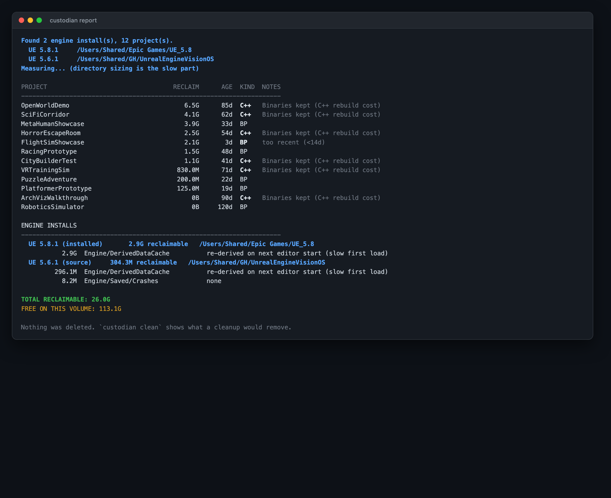
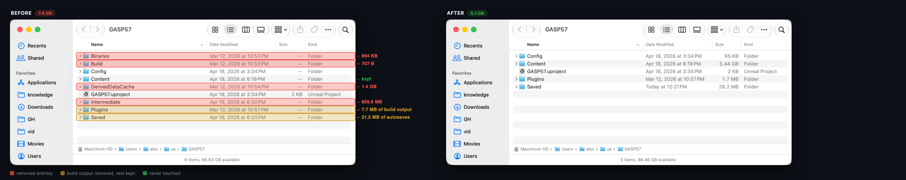
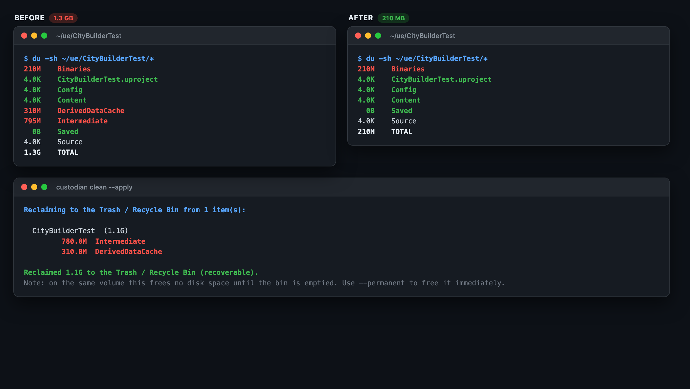

# Unreal Project Janitor

Find and reclaim the regeneratable build caches that Unreal Engine projects accumulate — `Intermediate`, `Binaries`, `DerivedDataCache`, cooked content and staged builds — across every project on your machine, without touching anything you authored.

A developer with a few years of Unreal projects on disk is typically sitting on tens or hundreds of gigabytes of pure rebuild artifacts. On the two machines this was tested against:

| | Projects | Engines | Reclaimable | Free space |
|---|---|---|---|---|
| macOS workstation | 96 | 2 | 224 GB | 60 GB |
| Windows workstation | 539 | 14 | **2.0 TB** | **17 GB** |

The Windows box had six source-built engines holding 60–75 GB each, and 17 GB of headroom.

Epic themselves agree these folders are junk: Fab's 15 GB submission limit is specified *excluding* `Saved` and `Intermediate`.



## Before and after

Here is a real project in Finder, with the actual cleanup plan drawn on top — `upj` tells you exactly which folders go, which shrink, and which it will not touch, before it touches anything. `GASP57`, 7.4 GB down to 5.1 GB:



Note what survives: `Content` (5.4 GB of authored assets), `Config`, the `.uproject`, and everything in `Plugins` and `Saved` except their build output. Everything removed regenerates on the next build.

A second project, `ThirdPersonClass`, where the caches dominated — 8.7 GB down to 359 MB:



## Install

Requires Python 3.9+. No dependencies for the CLI.

```bash
git clone https://github.com/ibrews/unreal-project-janitor.git
cd unreal-project-janitor
python3 -m upj.cli report
```

On Windows, install [Everything](https://www.voidtools.com/downloads/#cli) and put `es.exe` on your `PATH` (or beside this README) for instant project discovery. On macOS, Spotlight is used and there is nothing to install. Without either, a slower filesystem walk is used as a fallback.

## Things to Try

1. **See what you're sitting on.** `python3 -m upj.cli report` — inventories every Unreal project and engine install on the machine and prints total reclaimable bytes. Nothing is deleted; there is no flag that makes `report` destructive.
2. **Find out what it would cost you to reclaim it.** `python3 -m upj.cli report --detail` — breaks each project down by directory and states what you pay to get each one back ("full rebuild", "re-cooked on next package", "UNRECOVERABLE if it held post-crash work").
3. **Preview a real cleanup.** `python3 -m upj.cli clean --ignore-pressure` — prints the exact directories that would be removed. `clean` is a dry run unless you pass `--apply`.
4. **Protect a project you're about to return to.** Drop a `.ueclean.json` next to its `.uproject` containing `{"enabled": false}`, then re-run step 3 and watch it drop out of the plan with an "opted out" note.
5. **Actually reclaim it.** `python3 -m upj.cli clean --apply` — everything goes to the Trash or Recycle Bin, not `rm -rf`, so a policy you disagree with costs you a drag-and-drop rather than a rebuild. Add `--permanent` once you trust it, which skips the bin and frees the space immediately.

## How it decides

**Disk pressure is the trigger; age is the ranking.** A plain "14 days untouched, delete it" rule will eventually eat the project you were about to reopen, and the cost of being wrong is asymmetric — a C++ project is a 10–20 minute rebuild plus a shader recompile, not a 10 second one. By default nothing happens until the volume drops below 100 GB free, and then the largest eligible projects are reclaimed until you are back above the line. Unreal cache sizes are strongly barbell-distributed — two projects were 26 % of the total on the development machine — so largest-first usually means touching very few projects.

Set `min_free_gb` to `0`, or pass `--ignore-pressure`, if you want age alone to trigger cleanup.

**Freshness is measured twice, because mtimes lie.** Copying a project, restoring it from backup, or syncing it through cloud storage rewrites every mtime and makes a long-dead project look like it was touched this morning. So alongside the filesystem mtime of `Content`/`Source`/`Config`, the tool reads Unreal's rotated editor logs, which encode their timestamp in the *filename* and therefore survive a copy intact. When the two disagree by more than a month, the report says so.

**Trash by default, permanent on request.** `--apply` moves reclaimed directories to the Trash or Recycle Bin so a mistake costs a drag-and-drop. The catch is that on the same volume this frees *no disk space at all* until the bin is emptied — so `--permanent` deletes outright for when you are actually out of room. The tool says which one it did, every time.

**Refusals are reported, not fatal.** Directories owned by another user — extremely common in projects copied between machines — are reported up front with the owning uid, rather than failing one `move` at a time after the plan has already started running. If a `Plugins/Foo` directory is a symlink into a different checkout, reclaiming through it would delete build artifacts from a repository you never named — so it is skipped, with a note, and the rest of the project is still processed.

## Engine installs are usually the bigger prize

Projects get the attention, but a **source-built** engine holds far more reclaimable output than an entire project library. On the development machine:

| | UE 5.8 (launcher install) | UE 5.6 (source build) |
|---|---|---|
| `Engine/Intermediate` | 3.3 GB | **90.0 GB** |
| `Engine/Binaries` | 16 GB | **56.6 GB** |
| `Engine/DerivedDataCache` | 2.9 GB | 296 MB |
| Total install | 55 GB | 430 GB |

One source engine was holding **146.8 GB** of rebuildable output — nearly double all 96 projects combined.

**The distinction that matters:** in a launcher install, `Engine/Binaries` *is* the engine. It was shipped precompiled, nothing on your machine can rebuild it, and deleting it turns a 55 GB install into a re-download. In a source build the same directory is genuine build output.

`upj` tells them apart by the marker UnrealBuildTool leaves behind — `InstalledBuild.txt` versus `SourceDistribution.txt` — and enforces the rule in code rather than trusting a flag. An engine with neither marker is treated as installed, because guessing wrong in that direction is the expensive mistake.

Engine caches and logs are reclaimed by default on both kinds. The big two are opt-in even on a source build, because reclaiming tens of gigabytes costs you a multi-hour engine rebuild:

```bash
python3 -m upj.cli report --engine-rebuildable
```

## What is never deleted

`Content`, `Source`, `Config`, the `Plugins` directory itself, and `Saved/SaveGames` are protected. This is asserted in code at the point of deletion, not merely documented — an intention that isn't checked is not a safety property. See `tests/test_policy.py`, which exists specifically to hold that line.

In an engine install, `Engine/Source` is never a target, and `Engine/Binaries` and `Engine/Intermediate` are refused outright on precompiled installs.

`Saved/Autosaves` is removable but gated at 90 days regardless of your other settings, because after an editor crash it is sometimes the only copy of an hour's work. `Saved/Config` is opt-in, since losing it costs you your editor layout. For C++ projects `Binaries` is kept by default; for Blueprint-only projects it regenerates on open and is reclaimed.

## Per-project configuration

Drop a `.ueclean.json` next to the `.uproject`. It layers over the global defaults, and it is safe to commit so a team shares one policy.

```json
{
  "enabled": true,
  "min_age_days": 30,
  "min_free_gb": 100,
  "keep_binaries_for_cpp": true,
  "targets": ["intermediate", "plugin_intermediate", "ddc", "cooked", "staged", "logs", "crashes"]
}
```

An unrecognized key in `targets` is a hard error rather than a silent no-op, so a typo can't quietly disable a protection you thought you had.

## The GUI

```bash
python3 -m upj.gui
```

Sortable table of every project with its reclaimable size, last-touched date, engine version and eligibility; engine installs below; double-click to launch. The Trash/permanent choice is a checkbox, and "Never clean this" writes the `.ueclean.json` opt-out for you.

Note the GUI needs a Python built with `tkinter`. The CLI has no such requirement and runs on the Python that ships inside Unreal itself (`Engine/Binaries/ThirdParty/Python3/`) — that bundled interpreter has no `tkinter`, so it cannot run the GUI.

## Automating it

The launcher GUI is deliberately *not* where automatic deletion lives. The GUI is open precisely when you are about to open a project — the worst possible moment to be clearing its build cache. Run the CLI from `launchd` (macOS) or Task Scheduler (Windows) instead, when nobody is working:

```bash
python3 -m upj.cli clean --apply
```

With the default pressure threshold this is a no-op on a healthy disk and only acts when space is genuinely short.

## Credits

Project discovery — locating every `.uproject` and engine install on a machine via the OS file index rather than a filesystem walk, and reading engine versions out of `Build.version` — is built on **[Marshall (@nocxr)](https://github.com/nocxr)**'s Unreal Project Launcher. That index-first approach is the reason this tool is usable at all: a recursive search for `*.uproject` across a developer's drives takes minutes and times out, while Everything and Spotlight answer in well under a second. Thanks Marshall.

Built by [@ibrews](https://github.com/ibrews) and [@nocxr](https://github.com/nocxr).

## License

MIT — see [LICENSE](LICENSE).
